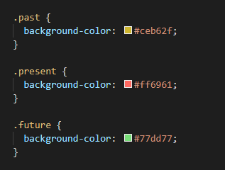

# Week-5-Homework
Work Planner

The assignment was to make a scheduler in the browser to enter events throughout the working hours and have them save. The current day of the week/date is at the top in the jumbotron and the scheduler is dynamically updated. You can enter data and save data, the background color 

